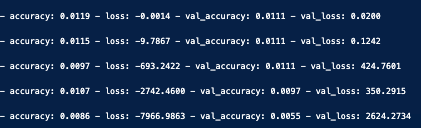

#### 12/24 공공데이터 일상생활 수어 데이터 셋 분석 및 간단 Naive 모델 생성

- 데이터 셋 : https://www.culture.go.kr/data/openapi/openapiView.do?id=367&keyword=%EC%9D%BC%EC%83%81%EC%83%9D%ED%99%9C%EC%88%98%EC%96%B4&searchField=all&gubun=A

- 개수 : 원천 데이터는 3834개였으나 중간에 랜드마크가 존재하지 않은 원천데이터도 있어서 선별한 결과 총 3609개의 데이터로 최종 데이터셋을 결정
- 구성 : 각기 다른 길이의 영상 프레임 수 > 33개의 키포인트 > 랜드마크의 X, Y, Z 좌표 값 (-1.0 ~ 1.0 범위)

33개의 키포인트

```
1. Nose (코)
2. Left Eye Inner (왼쪽 눈 안쪽)
3. Left Eye (왼쪽 눈)
4. Left Eye Outer (왼쪽 눈 바깥쪽)
5. Right Eye Inner (오른쪽 눈 안쪽)
6. Right Eye (오른쪽 눈)
7. Right Eye Outer (오른쪽 눈 바깥쪽)
8. Left Ear (왼쪽 귀)
9. Right Ear (오른쪽 귀)
10. Left Shoulder (왼쪽 어깨)
11. Right Shoulder (오른쪽 어깨)
12. Left Elbow (왼쪽 팔꿈치)
13. Right Elbow (오른쪽 팔꿈치)
14. Left Wrist (왼쪽 손목)
15. Right Wrist (오른쪽 손목)
16. Left Pinky (왼쪽 새끼손가락)
17. Right Pinky (오른쪽 새끼손가락)
18. Left Index (왼쪽 검지손가락)
19. Right Index (오른쪽 검지손가락)
20. Left Thumb (왼쪽 엄지손가락)
21. Right Thumb (오른쪽 엄지손가락)
22. Left Hip (왼쪽 엉덩이)
23. Right Hip (오른쪽 엉덩이)
24. Left Knee (왼쪽 무릎)
25. Right Knee (오른쪽 무릎)
26. Left Ankle (왼쪽 발목)
27. Right Ankle (오른쪽 발목)
28. Left Heel (왼쪽 발꿈치)
29. Right Heel (오른쪽 발꿈치)
30. Left Foot Index (왼쪽 발 검지)
31. Right Foot Index (오른쪽 발 검지)
32. Left Foot (왼쪽 발)
33. Right Foot (오른쪽 발)
```

---
###### 작업 FLOW
- 해당하는 데이터들은 구글의 mediapipe를 통해 키포인트의 랜드마크 좌표값들을 뽑아냄 -> npy 형태로 keypoint 디렉터리에 저장 (파일이름은 원천 데이터의 마지막 이름과 일치함)
- 저장된 keypointe들을 다시 load해와 DataFrame으로 만든 후 모델 학습을 위한 각기 다른 영상 길이의 패딩 작업 진행 (가장 긴 영상 길이로 패딩 획일화)
- LSTM, CNN 모델로 Naive한 모델 생성


> 트러블 슈팅
- LSTM, CNN 모델로 Naive한 모델을 만들었으나 그 loss율과 Accuracy가 눈에 띄게 낮음 CNN은 초기 시점부터 일관된 낮은 정확도를 보이는 현상도 나타남


